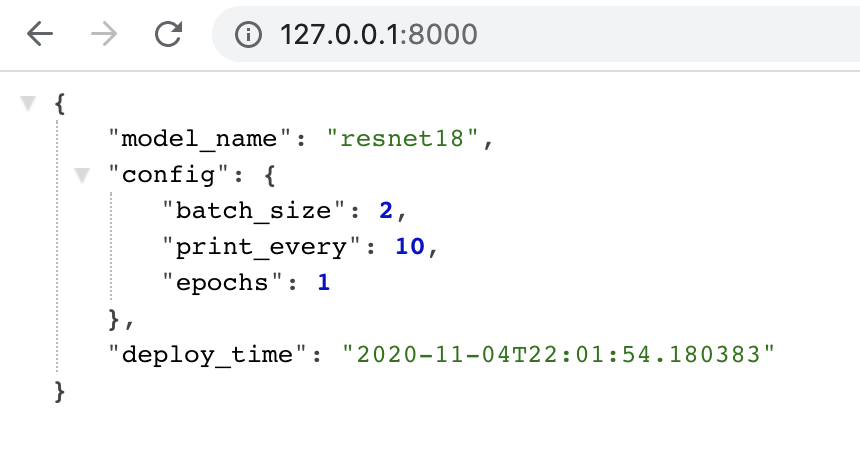

# Deployment

traintool can easily deploy your model through a REST API. This allows you to access the model from a website or application without shipping it with your code. 

Deployment uses [FastAPI](https://fastapi.tiangolo.com/) under the hood, which makes the API fully compatible with [OpenAPI/Swagger](https://github.com/OAI/OpenAPI-Specification) and [JSON Schema](http://json-schema.org/). 


## Deploying a model

To deploy a model after training or loading, simply run:

```python
model.deploy()
```

Note that the call to `deploy` is blocking, i.e. it should be run in a separate script. Also, it might not work well with Jupyter notebooks.

!!! tip
    By default, the API will run on 127.0.0.1 at port 8000, but you can modify this, e.g. `model.deploy(host=0.0.0.0, port=8001)`. 


## Accessing the API

To access the API, navigate your browser to http://127.0.0.1:8000/. If everything worked out, you should see some basic information about the deployed model like below:

 

To find out more about the API, check out the API docs at http://127.0.0.1:8000/docs. They contain information about all endpoints and required data types. 


## Making predictions

If you want to make a prediction with the API, you need to make a POST request to the `/predict` endpoint (http://127.0.0.1:8000/predict). The request body should look like this:

```json
{
    "image": [[[0, 0.5, 0, 1], [0, 1, 0, 0.5]]]
}
```


`"image"` is a list of lists with shape `color channels x height x width`(here: a grayscale 4x4 image). You can easily get this list format from a numpy array with [numpy.ndarray.tolist](https://numpy.org/doc/stable/reference/generated/numpy.ndarray.tolist.html). Note that you cannot pass raw numpy arrays into the request because they are not JSON serializable. 

As in training, images can be RGB (3 color channels) or grayscale (1 color channel). They will be automatically preprocessed in the same way as the train data. If you used numpy images for training, make sure the image here has the same size and pixel range. If you used files, everything should be converted to the correct format automatically. 

!!! tip
    You can easily try out the `/predict` endpoint if you go to the API docs (http://127.0.0.1:8000/docs), click on `/predict` and then on the "Try it out" button on the right. 

The endpoint will return a JSON object which is very similar to the dictionary returned by `model.predict(...)`. Numpy arrays are again converted to lists of lists (convert back with [numpy.asarray](https://numpy.org/doc/stable/reference/generated/numpy.asarray.html)). The JSON should look like this:

```json
{
  "predicted_class": 2,
  "probabilities": [
    0.1,
    0.8,
    0.1
  ],
  "runtime": "0:00:00.088831"
}
```


